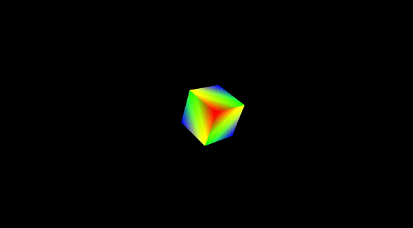

# Formas Geométricas em 3D no OpenGL

  
  
  
  

 

## Proposta da Atividade

O modelo RGB possui como primárias as cores aditivas vermelhas (R), verdes (G) eazuis (B), este modelo baseia-se na sensibilidade do olho, e usa um sistema de coordenadas cartesianas R, G, B, cujo subespaço de interesse é o cubo unitário mostradona figura abaixo:

Permita visualizar o **Cubo** de ângulos diferentes, podendo rotacionar a câmeraou o cubo,em tempo de execuçãoou gerar visualizações de diferentes perspectivas.

## Compilação e Execução

Primeiramente, realize o download do arquivo <code>projeto3d</code> disponibilizado. Em seguida, descompacte o arquivo de <code>dependencias</code> dentro da pasta do projeto para que a pasta seja integrada ao restante do projeto, assim como mostra a **Figura 1**. Por fim, para **realizar a execução** da aplicação, abra o Visual Studio 2022 em modo **administrador** e escolha a janela de execução como mostrado na **Figura 2**.

**Figura 1**: Descompactação e integração das dependências ao projeto.

**Figura 2**: Escolha da janela de execução do projeto.

## Cubo RGB em 3D

Logo abaixo, deixo um vídeo GIF que mostra o resultado da aplicação na criação do Cubo RGB em 3D.

**GIF** da janela do terminal onde temos nosso **Cubo RGB 3D** sendo **APROXIMADO** e **DISTANCIADO**, enquanto esta sendo **ROTACIONADO**.

